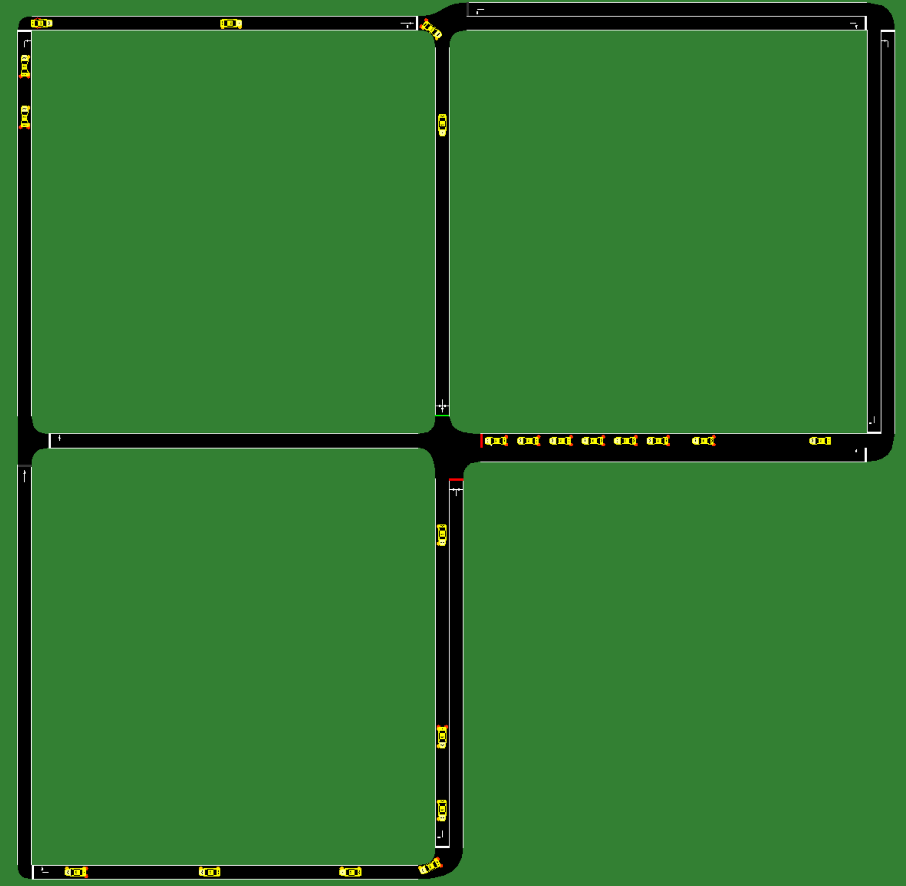
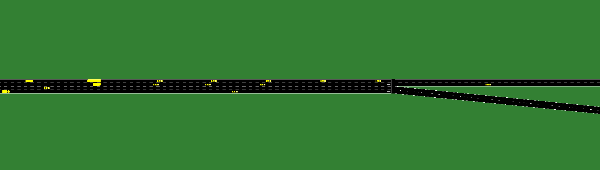
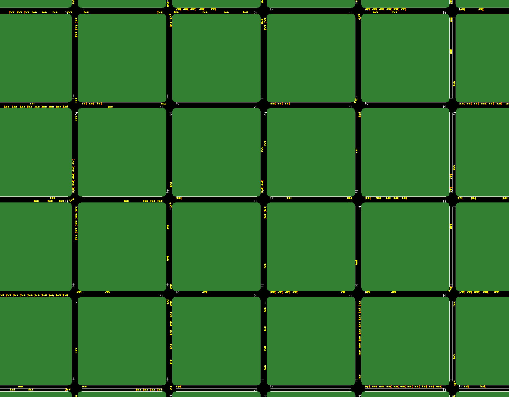

# Microscopic Modelling and Simulation of Traffic Operations 
## [ETH-Course-ID 101-0492-00L]
## Kevin Riehl [ETH Zürich, Institute for Transportation Planning and Systems IVT, Traffic Engineering Group SVT]

## Lecture 02: Components of Microsimulations & SUMO Introduction

### Structure of a SUMO Microsimulation project
Each SUMO simulation consists of at least three files (the fourth is optional) and defines several aspects for the microsimulation...
- **Configuration.sumocfg**
    - What network to use?
    - What routes to use?
    - Additional files?
    - What to log during simulation?
- **Network.net.xml**
    - Edges (roads = set of lanes)
    - Lanes (lanes of roads)
    - Geometric shape
    - Intersections
    - Connections (which lane with which junction)
    - Junctions (curvy lanes on the intersection to cross)
    - Traffic Lights
- **Routes.xml**
    - Route (=set of edges)
    - Flows
- **AdditionalFiles.xml**
    - Special Points
    - Sensors (Loop Detectors)
    - Variable Traffic Light Signs
    - Bus stops
    - Parking space
    - Charging station
    - …

### Three example projects
This folder contains three exemplary sumo simulations.

- sumo_example_hello_world_logging

- sumo_example_highway_bifurcation

- sumo_example_manhattan_5x5

### Excercises

**First Tasks: Introduction** 
1. Run each simulation and watch them. During the runtime, you can zoom in, move, and even track single vehicles during their journey.
2. Have a look on the XML files of each project and try to understand the structure. Use text editor tools such as `Notepad++` to open the XML files.
3. Play around and change some numbers, rerun the simulation, and see what happens.

**Second Task: Understand the Logs from Hello World Logging"**
- After successfully running the examples, inside the simulation folders two output files will be generated, including information that was logged during the simulation, called `Output_LaneData.xml` and `Output_Full.xml`.
- Open these files and try to understand the outputs.
- Could you track the position and speed of a single vehicle over time?
- Could you determine the average speed, density (vehicles per km), and flow (vehicles passing per hour) for each lane / road?

**Third Task: Change the number of vehicles in the highway bifurcation example**
- Try to edit the number and types of vehicles, so that congestion occurs after some runtime of the simulation.
- How can you achieve more or less congestion?
- Play around with the number of vehicles, but also with parameters that control their cooperation, patience, and aggressiveness.

**Fourth Task: Tracking Single Vehicle in Manhattan**
- Stop the simulation in the middle by pressing the red button.
- Click on `Locate` and then `Vehicles` in the menubar.
- Select a random vehicle from the list, and click `Center`.
- Then you should automatically jump with the viewport to that specific car.
- Then click `Track` and continue the simulation by pressing the green `Run` button. You should now follow the car while it is driving through the network.

**Have Seen enough already?**
- I guess you are curious about creating your own network. 
- Feel free to read the documentation of SUMO, checkout some tutorials, or help your colleagues solve their issues.