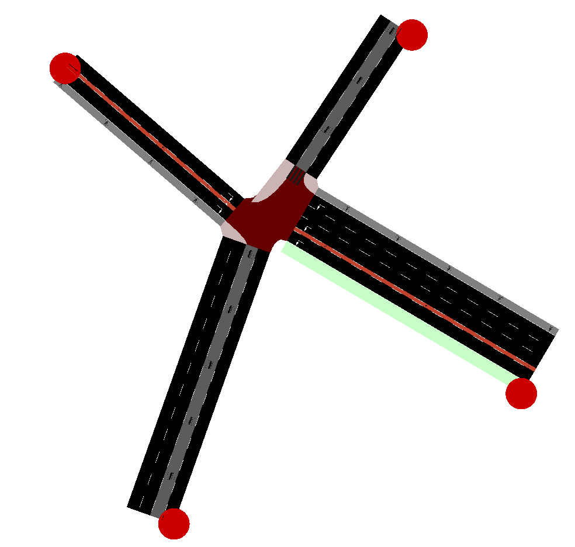
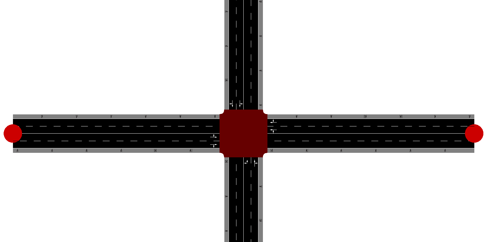
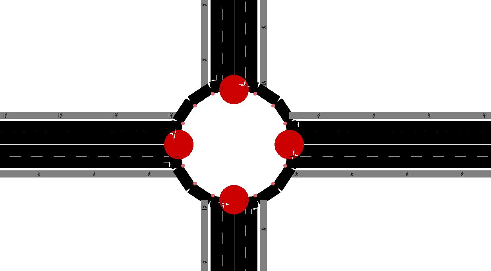

# Microscopic Modelling and Simulation of Traffic Operations 
## [ETH-Course-ID 101-0492-00L]
## Kevin Riehl [ETH Zürich, Institute for Transportation Planning and Systems IVT, Traffic Engineering Group SVT]

## Lecture 03: Create Network & Demand Models

### Three example projects
This folder contains three exemplary sumo simulations.

- sumo_example_network_crazy_star



- sumo_example_network_intersection



- sumo_example_network_intersection_roundabout



- sumo_example_demand_flow_vehicles

- sumo_example_demand_single_vehicles


### Excercises

**First Task: Introduction** 
1. Run each simulation and watch them. During the runtime, you can zoom in, move, and even track single vehicles during their journey.
2. Have a look on the XML files of each project and try to understand the structure. Use text editor tools such as `Notepad++` to open the XML files.
3. Play around and change some numbers, rerun the simulation, and see what happens.

**Second Task: Build your own network from scatch** 
1. Go to Google Maps, and search an intersection you find interesting (e.g. from your homecity, the larger roundabout of Paris, Zurich HB / city center).
2. Open application `NetEdit`, and click `File` -> `Create New Network`.
3. Play around with the GUI and try to build the network you want.

**Third Task: Build a specified network from scatch** 
1. Open application `NetEdit`, and click `File` -> `Create New Network`.
2. Build a network that has at least: 
 - three intersections
 - two bus stops
 - one edge with three lanes
 - a pedestrian lane
 - a bicycle lane
 - a bus lane
 - one roundabout (you can convert a normal intersection to a roundabout)

**Fourth Task: Import a network from Open Street Map (OSM)**
1. Open your browser application.
2. Go to [https://www.openstreetmap.org/export#map=15/49.96411/8.38424](https://www.openstreetmap.org/export#map=15/49.96411/8.38424).
3. This is Open Street Map showing my home village (Bauschheim in Germany).
4. You can click the button `Export` and download the map as `.OSM` file.
5. Open application `AnacondaPrompt `.
6. Use  `cd ` command to navigate to the folder where you installed SUMO, e.g.  `cd C:/Programs/Local/sumo-1.19.0 `.
7. Convert the downloaded  `.OSM ` file to a SUMO network with following command:
```
python tools/osmBuild.py --osm-file [PATH-TO-OSM-FILE]
```
8. Two files should have been generated:
- osm.net.xml
- osm.netccfg
9. Open application `NetEdit`, and click `File` -> `Open Network...` and select the file `osm.net.xml`.
10. Click `File` -> `Open Network Configuration...` and select the file `osm.netccfg`.
11. Explore my home village ;-) and feel free to remove roads you dont like (e.g. the highway).

There are also alternatives how to download OSM material. 
The browser based version is limited by the maximum area you can cover.
More information on the alternatives can be found here: [https://sumo.dlr.de/docs/Networks/Import/OpenStreetMapDownload.html](https://sumo.dlr.de/docs/Networks/Import/OpenStreetMapDownload.html).

**Fifth Task: Combine Network and Demand Model**
- After successfully creating maps in the previous three tasks, pick one of them.
- Open application `Notepad++`.
- Generate a `Demand.xml` and `Configuration.Configuration.sumocfg` manually for the network.
- Run your simulation and develop an understanding of how to create demand models.

**Have seen enough already?**
- I guess you are curious about creating your own network. 
- Feel free to read the documentation of SUMO, checkout some tutorials, or help your colleagues solve their issues.