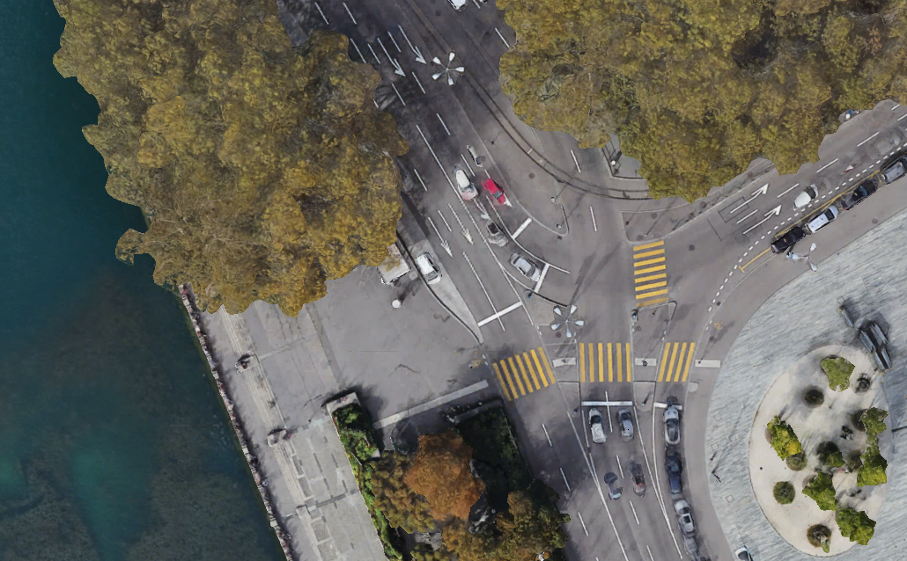

# Microscopic Modelling and Simulation of Traffic Operations 
## [ETH-Course-ID 101-0492-00L]
## Kevin Riehl [ETH Zürich, Institute for Transportation Planning and Systems IVT, Traffic Engineering Group SVT]

## Lecture 04: Signals, Sensors, Public transport, Calibration

### Three example projects
This folder contains three exemplary sumo simulations.

- sumo_example_demand_flow_vehicles

- sumo_example_network_intersection_pedestrians

- sumo_example_sensor_logging

### Excercises

**First Task: Introduction** 
1. Run each simulation and watch them. During the runtime, you can zoom in, move, and even track single vehicles during their journey.
2. Have a look on the XML files of each project and try to understand the structure. Use text editor tools such as `Notepad++` to open the XML files.
3. Play around and change some numbers, rerun the simulation, and see what happens.

**Second Task: Highway with realistic vehicle composition and demand** 
1. Create a network with a four lane highway in one direction (2km long).
2. Set the speed limits to 100 km/h.
3. Define vehicle types based on the templates provided by SUMO:
    - At least three types of cars (vary their aggressiveness)
    - At least two types of trucks (vary their aggressiveness)
    - At least one bus (vary their aggressiveness)
    - At least three types of delivery vehicles (vary their aggressiveness)
4. Define Flows or Single Vehicles to model the demand.
5. Run the simulation and observe. Repeat to create a realistic highway scenario.

**Third Task: Macroscropic Fundamental Diagram Of The Highway**
6. Place some sensors to count traffic.
7. Run the simulation.
8. Parse the XML files produced by the simulation with Python.
9. Determine the macroscopic fundamental diagram of the highway and display it.

**Fourth Task: Utoquai Intersection**
1. Go to Open Street Map to coordinates 47.36641297652524, 8.545075397499442.
2. Download the intersection as shown in previous lecture.
3. Clean the map to have relevant in- and outflows of the intersection at Utoquai.
4. Make sure not only roads, but also pedestrian crossings are in place.
5. Define a certain demand model for cars, bicycles and pedestrians.
6. Define a certain fixed-cycle signal control for the intersection.
7. Run the simulation.
8. Can you create congestion? Can you solve resolve it with better signal times?

**Fifth Task: Utoquai Delay Distribution**
9. Place some sensors to count traffic.
10. Run the simulation.
11. Parse the XML files produced by the simulation with Python.
12. Determine the delay distribution of pedestrians, bicycles, and vehicles.

**Have seen enough already?**
- Feel free to work on your project / case study.
- Feel free to read the documentation of SUMO, checkout some tutorials, or help your colleagues solve their issues.