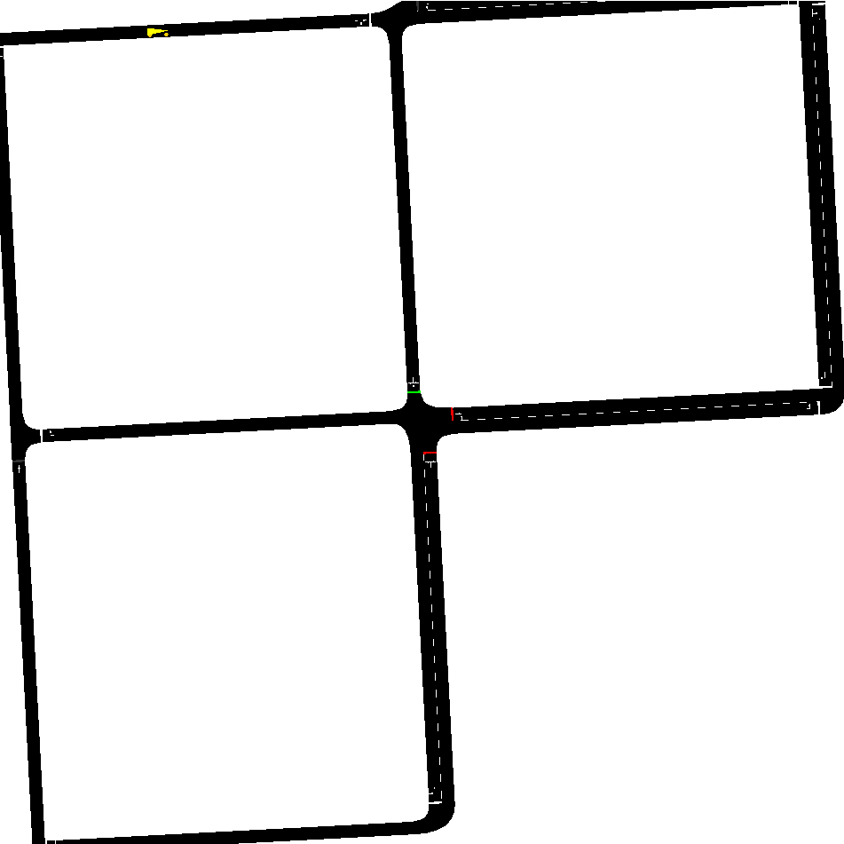

# Microscopic Modelling and Simulation of Traffic Operations 
## [ETH-Course-ID 101-0492-00L]
## Kevin Riehl [ETH Zürich, Institute for Transportation Planning and Systems IVT, Traffic Engineering Group SVT]

## Lecture 10: Visualization, Animation & Design – SUMO & Matplotlib

### Six example projects
This folder contains six exemplary sumo simulations.

- sumo_example_design_A
- sumo_example_design_background
- sumo_example_design_traci_screenshots
- sumo_example_diagram_space_time_diagram
- sumo_example_diagram_space_time_heatmap
- sumo_example_diagram_fundamental_diagram

### Excercises

**First Task: Design Basics** 
1. Run the simulation `sumo_example_design_A` with `SUMO-GUI`.
2. Can you change the design to a Barbie-like design? (Hint `custom_gui_design_barbie.xml`)
3. Run the simulation `sumo_example_design_background` with `SUMO-GUI`. 
4. Have a look at `custom_gui_design.xml`. Do you see how to embed the background image? (Hint `<decals>`)

**Second Task: Creating your Animation** 
1. Run the simulation `sumo_example_design_traci_screenshots` with `1_RunSimulation_TakeScreenshots.py` using Python.
2. Look into the screenshots folder.
3. Delete some of the first images (they are usually malformed).
4. Run the GIF-Animation script `2_CreateGIF.py` using Python.
5. Have a look at your generate GIF in a browser.
6. Check the code `1_RunSimulation_TakeScreenshots.py`.
7. Can you make something else? E.g. slower rotation, faster zoom, other point? Or completely other camera movement?

**Third Task: Diagrams**
1. Run the simulation `sumo_example_diagram_space_time_diagram`.
2. Run the simulation `sumo_example_diagram_space_time_heatmap`.
3. Run the simulation `sumo_example_diagram_fundamental_diagram`.
4. Read the code to understand how to render these very common diagrams in traffic engineering.

**Fourth Task: Your Project**
1. Think of what kind of animations of the simulation you would like to create for your project.
2. Think of what kind of diagrams of the simuatlion you need to create to answer the research questions of your project.

**Have seen enough already?**
- Feel free to work on your project / case study.
- Feel free to read the documentation of SUMO, checkout some tutorials, or help your colleagues solve their issues.